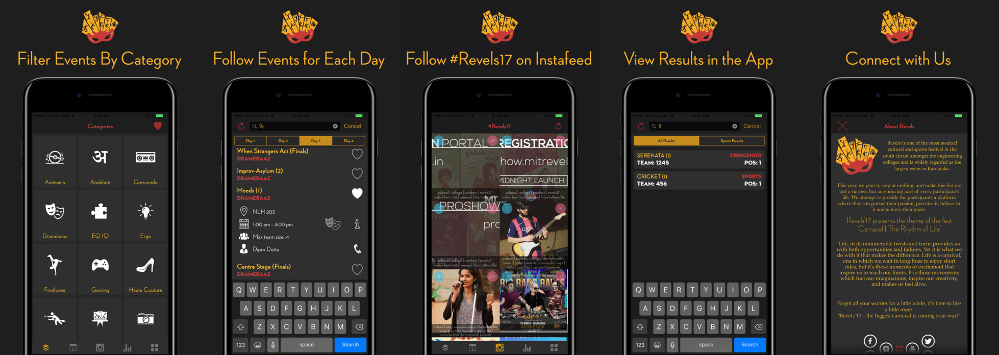

# Revels-17

The Official iOS App for Revels'17 cultural fest of MIT, Manipal.

Open-Source Project.

--------------------
## Features

- 3D Touch enabled Quick Action Menus from homescreen
- Offline Save
- Add interesting events to the favourites list
- Get Results on the go
- Get information about the workshops
- Instagram Integration (Use #Revels17 when posting pictures on Instagram)
- Save images from Instafeed to your phone
- Beautiful UI
- Works good on 2G networks

--------------------

## The app uses:

- [Firebase](http://firebase.google.com) as backend for notifications and alerts.
- [SDWebImage](https://github.com/rs/SDWebImage) for caching and async loading of images.
- [SVProgressHUD](https://github.com/SVProgressHUD/SVProgressHUD) as a clean and minimal heads up display. 
- [KWTransition](https://github.com/KurtWagner/KWTransition) for some view transistions.
- [DZNEmptyDataSet](https://github.com/dzenbot/DZNEmptyDataSet) to easily handle empty data sets.
- [CAAnimationBlocks](https://github.com/xissburg/CAAnimationBlocks) to allow the usage of start and completion blocks in CAAnimation instances.
- [UINavigationItem-Loading](https://github.com/Just-/UINavigationItem-Loading) to show loading progress in naigation bar.

--------------------

### Keys

The Project uses [Firebase](http://firebase.google.com) as backend and therefore needs Client key and Application ID.  
To obtain these you may message us at our [Facebook Page](https://www.facebook.com/LUGManipal/).
